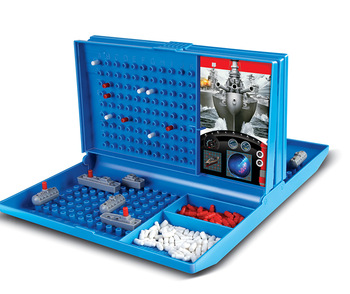
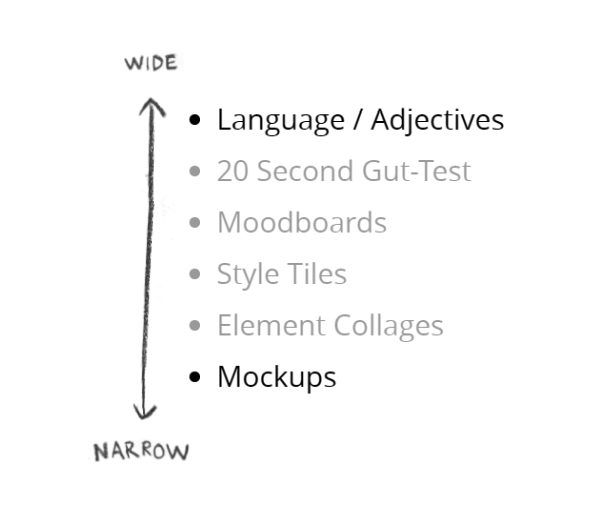

# Style Direction: A Systematic Approach

The current digital product design world sports a seemingly endless array of tools and process which we are able to employ in service of establishing the functionality and structure of our products. Journey mapping, wire-framing, site-mapping and rapid prototyping have long been stock standard in the digital designer's toolbox.

Paradoxically, there seems to be very little established processes or tools that allow teams to cross-functionally iterate over concerns that are of a more aesthetic, stylistic or look-and-feel nature. It more often seems that this part of the discussion is exclusively left up to the visual team alone, with very little actionable input from the rest of the team. Are we doomed to a world of "Make it classic, but with a modern twist" or "It needs to be professional, but with a casual feel" adjective-salads? Where we attempt our best interpretation of these slippery terms, hoping that the team or client leave us alone to be the sole "experts" when it comes to deciding on aesthetics?

Fortunately, it doesn't need to be this way. 

**Below I cover some approaches that I've borrowed from other teams and individuals, and how you \(in the spirit of iteration\) can remix and work them into your own design process.**

**I recently started teaching Interaction Design at the** [**Creative Academy**](https://creativeacademy.ac.za)**, a tertiary-level design school situated in** [**Cape Town, South Africa**](https://en.wikipedia.org/wiki/Cape_Town)**.**

It's been a couple of years since I started my journey into the world of web design, and in the context of the former, I started retracing some of my steps. This included, among others, rummaging through several bookcases in search of a dusty [Don't Make Me Think](https://www.amazon.com/Dont-Make-Think-Revisited-Usability/dp/0321965515) by [Steve Krug](https://en.wikipedia.org/wiki/Steve_Krug) and \(the more recent\) [Atomic Design](https://shop.bradfrost.com/) by [Brad Frost](https://bradfrost.com/). I also went back into history, re-reading some formative [Smashing Magazine](https://www.smashingmagazine.com/) and [A List Apart](https://alistapart.com/) articles.

A decade is a long time.

I was \(perhaps reasonably\) anticipating that most of the material would age poorly. However, I'm surprised by the degree to which it holds up. One thing I didn't anticipate though is how my own experiences over the last couple of years would shape my re-reading of the material. Some sections and paragraphs that I  initially glossed over ended up being treasure troves this time around. The most prominent was perhaps the introductory paragraph to [Style Tiles and How They Work](https://alistapart.com/article/style-tiles-and-how-they-work) by [Samantha Warren](http://samanthatoy.com/) \(current _Director of Design_ at [Adobe](https://www.adobe.com/)\):

> _When you engage in a new client project how do you get started? A solid process plays a critical role in the project’s overall success, yet this process is one of the deepest darkest secrets of our industry_.
>
> — Samantha Warren, [Style Tiles and How They Work](https://alistapart.com/article/style-tiles-and-how-they-work)

This really resonated with me.

My time in the industry shaped my appreciation for the ease with which a robust design process can derail due to a designer \(or design team\) not fully stepping into their role as process facilitator.

### Designing as Facilitation

Which makes sense.

**I, myself, had a naive expectation at one point that a designer's job would be purely technical in nature.** 

However, over time I've come to realise that modern-day web designers not only create external-facing deliverables, but also internal-facing experiences intended to aid the client \(or team\) with the process itself. Futhermore, I became aware of how anaemic this hidden part of the process tends to be. From what I've been able to piece together \(at that time\) it seemed to come down to a misconception of designers as solitary, creative creatures that disappear into their respectively caves \(or perhaps cubicles\) and re-emerge with a creative masterpiece - seemling creating something from the nothingness of blank page or screen.

I've slightly over-dramatised the above for comedic effect. However, in practice, this assumption tends to plays out more subtly. To quote [Adam Connor](http://adamconnor.com/) and [Aaron Irizarry](https://www.linkedin.com/in/aaroni/) from their seminal [Discussing Design](https://www.oreilly.com/library/view/discussing-design/9781491902394/) \(2015\):

> _What individuals and organizations that fall into this trap fail to realize is that when a project is tasked with making something, no matter what it is, every single team member is a part of the design process. Design doesn’t just happen in the design department. It happens with every decision about what will or won’t be part of the final product, whether that’s a feature, a paragraph of content, a color pallet, a user interface pattern — anything._
>
> _\[...\]_
>
> Collaboration and coordination are critical elements in the success of projects in most \(if not all\) modern organizations. There isn’t a single individual who is responsible for coming up with an idea, designing it, building it, selling it, and supporting it. Instead, these responsibilities and the expertise that come with them are divided among a variety of contributors who each bring knowledge to the team. So, we need to work together, combining our skills and know-how. And to work together, we need to talk with one another. We need to discuss what it is we’re designing, why we’re creating it, and how it will all come together.

Luckily \(from where I was standing\), it appeared as if change was on the horizon.

I started seeing teams catch onto this notion. [Personas](https://en.wikipedia.org/wiki/Persona_%28user_experience%29), [experience maps](https://en.wikipedia.org/wiki/User_journey) and [user stories](https://en.wikipedia.org/wiki/User_story) started becoming more cross-functional and inter-departmental instead of something that was handed off by a single designer. In my own microcosm working at [OpenUp](https://openup.org.za/), it seemed unreal how easily we were able to persuade  [South Africa's National Department of Treasury](https://openup.org.za/projects/vulekamali), a government department known for layers of bureaucracy, to actively engage in these exercises.

**Indeed cross-functional** [**design thinking**](https://en.wikipedia.org/wiki/Design_thinking) **seems to have entered the mainstream.**

However, I couldn't help but feel that we still missed one piece of the puzzle: a deliberate and calculated way in which to iterate and discuss stylistic \(or otherwise known as look-and-feel\) concerns. More often than not conversations about stylistic decisions were preceded by designers retreating once again behind their magical creative-curtains and re-emerging with beautifully styled elements. We were lucky enough to have the incredibly talented [Matthew Stark](http://matthewstark.co/) at on board OpenUp, which meant that more often than not, we landed firmly on our feet. However, I couldn't shake the feeling that our approach boiled down to a leap of faith into the world of look-and-feel.

In short, it went something along these lines:

1. Have an initial discussion that included a lot of my branding-speak bingo: 'Respected', 'Playful', 'Modern', 'Friendly', 'Classic', 'Trustworthy', 'Professional' or 'Delightful' \(to name a few\).
2. Designers would leave and after some time present a general look and feel they feel represent these adjectives.
3. If the latter didn't quite hit the mark, then the process was repeated.

It felt like we were being teleported from a meticulous world of content, wireframes and user-flow into a subjective world of look-and-feel in a flash.

### Styling as Remixing

**The above might sound a lot like your own approach.**

You might even tell me that this process works very well for you.

The sheer scope and plurality of approaches in the current web design landscape are so far beyond what a single person can comprehend that I don't claim to have any insight into a one-true process. The risk \(and possible wastage of time/budget\) associated with taking this leap in your context might be so small that the reduced efficiency of learning a new process might not be worth it. There is a big difference between getting the style wrong for a plumber's website and the getting the look-and-feel wrong of a governmental's public data portal.

It might also be that you are already working inside well-established stylistic confines. Perhaps you are part of a larger corporate brand that already has a well thought-out design system, style guide, and/or pattern library.

**I short: you might find yourself in web design heaven.**

However, for the rest of us that are still stuck in purgatory \(between words like 'Modern'/'Classic' and a high-fidelity mock-up\) there has to be numerous tools to approach styling as a systematic, cross-functional exercise? Right?

**Not exactly.**

When compared against tooling around establishing content, functionality and structure of the things we build, the tooling around establishing style seem pretty lack-luster. Luckily, there are some good resources here and there. You just need to know where to look. 

In my experience, good discussions around establishing style tends to pop up where-ever you find these folks:

* [Dan Mall](https://danmall.me/)
* [Andy Clark](https://stuffandnonsense.co.uk/about)
* [Brad Frost](https://bradfrost.com/)
* [The Clearleft Team](https://clearleft.com/)

An interesting observation is that these individuals/teams tend to be big advocates of [designing in the open](https://bradfrost.com/blog/post/designing-in-the-open) too. I can only speculate, but my guess is that at the root of our reluctance to discuss/share the look-and-feel part of our process is rooted in insecurity. One that brings to the forefront something that is at odds with the romantic vision of designers as solitary, creative-creatures that bring ideas into existence out of nothing.

However, by now it's probably clear that my personal understand is at odds with this notion. Furthermore, from a purely academic point of view, web design \(perhaps more so than any other field of design\) is deeply embedded in what anthropologists like [Claude Lévi-Strauss](https://en.wikipedia.org/wiki/Claude_L%C3%A9vi-Strauss) call [bricolage](https://en.wikipedia.org/wiki/Bricolage):

> _"This is what is commonly called ‘bricolage’ in French. In its old sense the verb ‘bricoler’ applied to ball games and billiards, to hunting, shooting and riding. It was however always used with reference to some extraneous movement: a ball rebounding, a dog straying or a horse swerving from its direct course to avoid an obstacle. And in our own time the 'bricoleur' is still someone who works with his hands and uses devious means compared to those of a craftsman. \[...\]_
>
> The ‘bricoleur’ is adept at performing a large number of diverse tasks; but, unlike the engineer, he does not subordinate each of them to the availability of raw materials and tools conceived and procured for the purpose of the project. His universe of instruments is closed and the rules of his game are always to make do with ‘whatever is at hand’, that is to say with a set of tools and materials which is always finite and is also heterogeneous because what it contains bears no relation to the current project, or indeed to any particular project, but is the contingent result of all the occasions there have been to renew or enrich the stock or to maintain it with the remains of previous constructions or destructions._"_
>
> — Claude Lévi-Strauss, [The Savage Mind](http://web.mit.edu/allanmc/www/levistrauss.pdf) \(1962\)

**That is quite a mouthful!** 

Luckily it can be paraphrased as the following:, [Austin Kleon](http://austinkleon.com/) paraphrases it as follows in [Steal Like an Artist](https://austinkleon.com/steal/) \(2012\):

> _The writer Jonathan Lethem has said that when people call something “original,” nine out of ten times they just don’t know the references or the original sources involved. What a good artist understands is that nothing comes from nowhere. All creative work builds on what came before. Nothing is completely original._
>
> _\[...\]_
>
> _If we’re free from the burden of trying to be completely original, we can stop trying to make something out of nothing, and we can embrace influence instead of running away from it._
>
> — Austin Kleon, [Steal Like an Artist](https://austinkleon.com/steal/) \(2012\)

I find it interesting that we don't have these same conflicting feelings around functionality, no one has ever been accused of "stealing" one of the following ideas:

* Having a header that sticks to the top of the screen as you scroll down.
* Having an input form in the footer to sign up for a newsletter.
* Having a "scroll-to-top" button.
* Having a pop-up 

The reality is that the our interfaces are built on convention and user familiarity. Not only do I see the way towards a more deliberate process around style/look-and-feel as being embedded in approaching web design as remixing, but that it furthermore requires us to have the courage to expose this hidden part of the process to our peers and clients.

Our style decisions come from somewhere, let us own these sources instead of hiding them.

### Elimination as Creation

It is perhaps fitting that Austin Kleon \(whom we quoted above\), initially made a name for himself by creating [Vocabularyclept poems](https://en.wikipedia.org/wiki/Vocabularyclept_poem). A technique initially devised by early [Dadaists](https://en.wikipedia.org/wiki/Dada), in which a series of poems are assembled by recomposing existing textual content from newspaper clippings or even existing literature. Late Beat-era poet, [William S. Burroughs](https://en.wikipedia.org/wiki/William_S._Burroughs), really pushed this concept to its limit with a 336-page work of fiction titled [The Soft Machine](https://en.wikipedia.org/wiki/The_Soft_Machine) \(1961\). Both Kleon and Burroughts, in creating these works, highlight not only how central bricolage is to the act of any creative act, but that selecting what to exclude \(by the act of cutting itself\) is equal in centrality. As Mark Twain eloquently put it:

> Writing is easy. All you have to do is cross out the wrong words

I would say that establishing a look-and-feel direction is easy, you just need to cross out the wrong directions. To a certain degree, this is what we've been doing, however we've been doing this by committing to a look-and-feel first before we know whether it should be crossed out.

It would be to our benefit if we were able eliminate the wrong approaches by means of wider strokes. Brad Frost articulates a similar vision in [Atomic Design](https://atomicdesign.bradfrost.com/) \(2016\): 

> I believe a successful digital design process is quite similar to subtractive stone sculpture. At the beginning of the sculpting process, the artist and their patron have a general idea of what’s being created, but that vision won’t be fully realized until the sculpture is complete.
>
> The sculptor starts with a giant slab of rock and starts chipping away. A crude shape begins to form after the first pass, and the shape becomes more pronounced with every subsequent pass. After a few rounds of whacking away at the rock, it becomes clear that the sculptor’s subject is a human form.
>
> — Brad Frost, [Atomic Design](https://atomicdesign.bradfrost.com/) \(2016\)

I've shared this analogue with various practitioners and students over the years. It has served me extremely well. The critical implication \(once again\) being that similar to sculpturing we should start with broad strokes of negation \(or as Brad put it "whacking away at rock"\) before we start refining smaller details. 

However, I've always felt that there might be a better analogy, since the above doesn't make provision for tools and material artefacts that might guide this process. That is until I stumbled across an analogue that does allow this:

**The game of** [**Battleship**](https://en.wikipedia.org/wiki/Battleship_%28game%29)\*\*\*\*

If you're not familiar with the rules of Battleship, they are as follows:

1. Each player starts with two different grid-based surfaces:
   * One to place your ships and record which of \(and where\) your own ships have been hit.
   * Another to record your own shots against the other player \(and whether they miss or hit\).
2. Players take turns to fire shots by guessing coordinates where the other player's ships might be placed \(for example `E2` or `H7`\)
3. If you guess correctly you add a red pin to your representation of the other players area, if you guessed incorrectly you add a white pin.
4. The first one to sink all of the other player's ships wins.

As someone with a background in the visual arts I can't help but feel that this is also similar to how one would approach a painting. Starting with broad, big strokes and then working your way inwards refining detail as you go.

If you've never played Battleship before you might be tempted to start in one corner and incrementally work your way across the grid, as you would in [Go](https://en.wikipedia.org/wiki/Go_%28game%29). However, you'll soon find that this is an extremely inefficient approach. The common Battleship approach goes something along these lines:

**Start by scattering your guesses as widely as possible and only once something is hit should you start sweeping the immediate area around it, mapping out the type and shape of the ship in the area.**

Luckily we can take a similar approach to establishing an agreed upon style as follows:

### 20 Second Gut Test

Let's start start with an approach called to the [20 second gut test](https://clearleft.com/posts/20-second-gut-tests). This is quite similar to the common usability [5-second test](https://fivesecondtest.com/) that takes the following form:

> Five second tests are a method of user research that help you measure what information users take away and what impression they get within the first five seconds of viewing a design. They're commonly used to test whether web pages are effectively communicating their intended message.
>
> — [Usability Hub](https://usabilityhub.com/)

You can repurposed the latter for the sake of aesthetics/look-and-fee \(however you will need to extend the time to around 20 seconds, since these take a bit longer to take in\).

I've had a lot of success by doing the following: 

* Collecting various screenshots of websites or apps that I think fit the list of 
* Creating a slideshow \(I usually use [Slides.com](https://slides.com/) or [Google Slides](https://www.google.com/slides) - however any presentation software should work\)

### Moodboards

...

### Style Tiles

...

### Element Collages

...

### Iterating over Iteration

...

