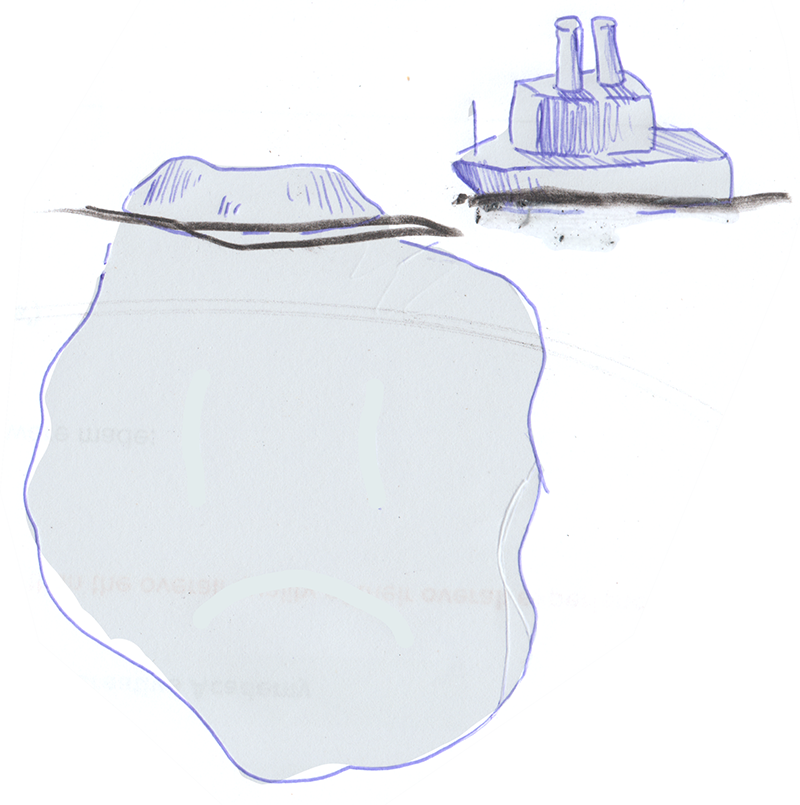

# The Other 90% of Design Direction

**I recently started doing some Interaction Design curriculum development for the** [**Creative Academy**](https://creativeacademy.ac.za)**, a tertiary-level design school based in** [**Cape Town, South Africa**](https://en.wikipedia.org/wiki/Cape_Town)**.**

 It's been a couple of years since I started my journey into the world of web design, and in the context of the former, I thought about retracing some of the steps that lead me to where I find myself today. The latter included, amongst others, rummaging through several bookcases in search of a dusty [Don't Make Me Think](https://www.amazon.com/Dont-Make-Think-Revisited-Usability/dp/0321965515) by [Steve Krug](https://en.wikipedia.org/wiki/Steve_Krug) and the more recent [Atomic Design](https://shop.bradfrost.com/) by [Brad Frost](https://bradfrost.com/). I also went back into history, re-reading some seminal [Smashing Magazine](https://www.smashingmagazine.com/) and [A List Apart](https://alistapart.com/) articles.

 Given that it's been almost a decade now, I was \(perhaps reasonably\) anticipating that most of the material would age quite poorly. To the contrary, I was surprised by the degree to which some of former still hold up. One thing I didn't anticipate though is just for how my own experiences over the last couple of years would shape how differently I would read them. Some sections and paragraphs that I quickly glossed over initially ended up being treasure troves of insight this time around. The most prominent was perhaps the introductory paragraph to [Style Tiles and How They Work](https://alistapart.com/article/style-tiles-and-how-they-work) by [Samantha Warren](http://samanthatoy.com/) \(current director of design at [Adobe](https://www.adobe.com/)\):

> _When you engage in a new client project how do you get started? A solid process plays a critical role in the project’s overall success, yet this process is one of the deepest darkest secrets of our industry_.

My time in the industry shaped my appreciation for the ease with which a robust design process can go off the rails. Furthermore, I also came to understand how much of the former is due to a designer \(or design team\) not fully stepping into the facilitator role.

### The Hidden Interface

 **Almost a decade ago, I had a naive expectation that a designer's job would be purely technical.** 

Over time I've come to realise that modern-day web designers are not only designing external-facing deliverables, but also internal-facing artefacts intended to help the client \(or team\) navigate the design process itself. Inevitably I became aware of how anaemic this aspect of the process tends to be in the industry at large. From what I've been able to piece together this seems to come down to a misconception of most designers as solitary, creative geniuses that disappear into their respectively little cubicles and re-emerge with artistic brilliance.

 I've over-dramatised the above for comedic effect, in practice, the above tends plays out more subtly. To quote [Adam Connor](http://adamconnor.com/) and [Aaron Irizarry](https://www.linkedin.com/in/aaroni/) from their seminal [Discussing Design](https://www.oreilly.com/library/view/discussing-design/9781491902394/) \(2015\):

> _What individuals and organizations that fall into this trap fail to realize is that when a project is tasked with making something, no matter what it is, every single team member is a part of the design process. Design doesn’t just happen in the design department. It happens with every decision about what will or won’t be part of the final product, whether that’s a feature, a paragraph of content, a color pallet, a user interface pattern — anything._
>
> _\[...\]_
>
> Collaboration and coordination are critical elements in the success of projects in most \(if not all\) modern organizations. There isn’t a single individual who is responsible for coming up with an idea, designing it, building it, selling it, and supporting it. Instead, these responsibilities and the expertise that come with them are divided among a variety of contributors who each bring knowledge to the team. So, we need to work together, combining our skills and know-how. And to work together, we need to talk with one another. We need to discuss what it is we’re designing, why we’re creating it, and how it will all come together.

However, it seems that change was on the horizon.

### Enter Human-Centered Design

Over time, much to my delight, I started seeing teams catch onto this notion. [User personas](https://en.wikipedia.org/wiki/Persona_%28user_experience%29) and [user stories](https://en.wikipedia.org/wiki/User_story) started becoming the rule rather than the exception across the industry. In retrospect, it seems unreal how easily we adopted these processes into the work we were doing for [South Africa's National Department of Treasury](https://openup.org.za/projects/vulekamali), a government department known for its adheres to five-year annual waterfall cycles.

**Indeed the language of user-centred design has become mainstream.**

 These turned out to be super-helpful when interrogating the ontological side of things \(in other words, figuring out what exactly we need to build, and how it will be structured\). However, I couldn't help but feel that there was still one piece of the puzzle missing: a deliberate and calculated way in which to iterate over the look and feel of the content and structure. More often than our conversations about stylistic decisions were preceded by the designer retreating behind the magic-creative-curtain mentioned above, while re-emerging with beautifully crafted interface elements. We were lucky enough to have the incredibly talented [Matthew Stark](http://matthewstark.co/) onboard, which means that more often than not, we landed firmly on our feet. However, I couldn't help feeling that the way we went about this coalesced in one massive visual leap of faith.

In short, we can summarise it as follows:

1. Have an initial discussion that includes a lot of my branding-speak bingo items: 'Playful', 'Modern', 'Friendly', 'Classic', 'Trustworthy', 'Professional' or 'Delightful'.
2. After some time, the design team present the rest of the team/client with a design that they feel represent these adjectives.
3. If the latter doesn't quite hit the mark, then the process is repeated.

It felt like we were continually being teleported between the meticulous world of content and structure with and the fuzzy world of look, feel and style. 

### Risk Management

**The above might sound a lot like the way you or your team approach the issue of design direction.**

You might even tell me that this process works very well for you.

The sheer scope and plurality of approaches in the current web design landscape are so beyond what a single person can comprehend, that I don't claim to have any insight into the one-true process that works for everyone. The risk associated with the above in your context might be so small that rethinking the way you design might result in a negative [return on investment](https://en.wikipedia.org/wiki/Return_on_investment). There is a big difference between getting the general look-and-feel wrong on a personal blog and getting the look-and-feel wrong on something like [https://pmg.org.za](https://pmg.org.za/).

It might also be that you are already working inside well-established stylistic confines. Perhaps you are part of a large corporate brand that has a well-thought-out design system, style guide and pattern library: mostly web design heaven.

However, for the rest of us that are stuck in web design purgatory, the following tend to be a helpful addition to our process:

### Manoeuvres in the Dark

